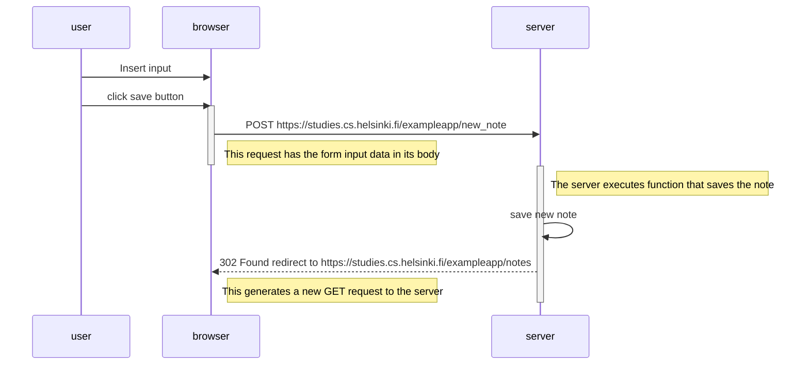

## Exercise 0.4

```mermaid
sequenceDiagram
    participant user
    participant browser
    participant server

    user->>browser: Insert input
    user->>browser: click save button

    activate browser
    browser->>server: POST https://studies.cs.helsinki.fi/exampleapp/new_note
    Note right of browser: This request has the form input data in its body
    deactivate browser
    
    activate server
    Note right of server: The server executes function that saves the note
    server->>server: save new note
    server-->>browser: 302 Found redirect to https://studies.cs.helsinki.fi/exampleapp/notes
    Note right of browser: This generates a new GET request to the server
    deactivate server
```