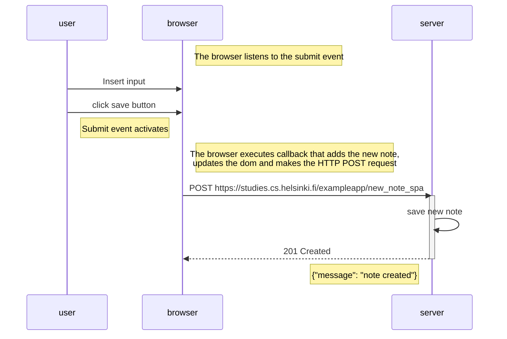

## Exercise 0.6

```mermaid
sequenceDiagram
    participant user
    participant browser
    participant server
    
    Note right of browser: The browser listens to the submit event
    
    user->>browser: Insert input
    user->>browser: click save button
    
    Note right of user: Submit event activates
    Note right of browser: The browser executes callback that adds the new note,<br /> updates the dom and makes the HTTP POST request

    browser->>server: POST https://studies.cs.helsinki.fi/exampleapp/new_note_spa

    activate server
    server->>server: save new note
    server-->>browser: 201 Created
    deactivate server

    Note left of server: {"message": "note created"}
```